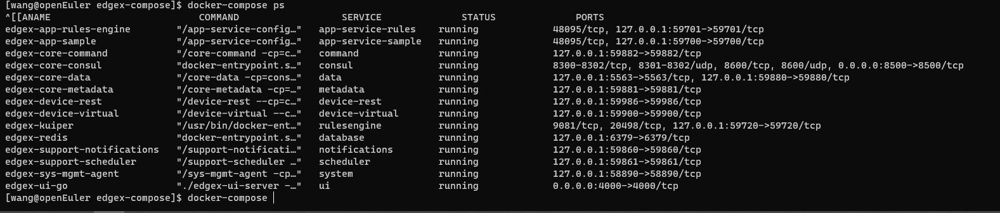

# Env
## Hardware
* [Intel NUC ](https://www.intel.cn/content/www/cn/zh/products/details/nuc.html)
## Software
* [OS openEuler 22.03 LTS](https://repo.openeuler.org/openEuler-22.03-LTS/ISO/x86_64/openEuler-22.03-LTS-x86_64-dvd.iso) 
# Install
 ## **Operation system install**
* 通过UltraISO 制作启动U盘，该部分请自行百度
* - 由于U盘名长度的限制，会导致`dracut-initqueue: Warning: dracut-initqueue timeout - starting timeout scripts` 的问题，需要在启动时修改`command line` 中的`hd:LABEL=` 为`openEuler-2` 与U盘名对应，按`F10` 启动正常安装.


## install
* 采用docker的方案去部署整个edgex的服务

### Docker Install
* 因为openEuler提供的repo源中，docker的版本过低，导致Edgex无法顺利运行，所以需要手动安装docker二进制包，并配置daemon 服务。
```
#改装docker 20.10.8
wget https://download.docker.com/linux/static/stable/x86_64/docker-20.10.17.tgz

dnf install tar -y
tar zxvf docker-20.10.17.tgz
cp -p docker/* /usr/local/bin

sudo cat > /usr/lib/systemd/system/docker.service <<EOF
[Unit]
Description=Docker Application Container Engine
Documentation=http://docs.docker.com
After=network.target docker.socket
[Service]
Type=notify
EnvironmentFile=-/run/flannel/docker
WorkingDirectory=/usr/local/bin
ExecStart=/usr/local/bin/dockerd -H tcp://0.0.0.0:4243 -H unix:///var/run/docker.sock --selinux-enabled=false --log-opt max-size=1g
ExecReload=/bin/kill -s HUP $MAINPID
# Having non-zero Limit*s causes performance problems due to accounting overhead
# in the kernel. We recommend using cgroups to do container-local accounting.
LimitNOFILE=infinity
LimitNPROC=infinity
LimitCORE=infinity
# Uncomment TasksMax if your systemd version supports it.
# Only systemd 226 and above support this version.
#TasksMax=infinity
TimeoutStartSec=0
# set delegate yes so that systemd does not reset the cgroups of docker containers
Delegate=yes
# kill only the docker process, not all processes in the cgroup
KillMode=process
Restart=on-failure
[Install]
WantedBy=multi-user.target
EOF

systemctl enable docker
systemctl start docker
# 验证docker 安装正确
docker run hello-world


```
* 安装docker-compose
```
wget https://github.com/docker/compose/releases/download/v2.7.0/docker-compose-linux-x86_64
mv docker-compose-linux-x86_64 docker-compose

chmod +x docker-compose
mv docker-compose /usr/local/bin

```
# Demo

```
# 拉取相关仓库
dnf install git -y

git clone https://github.com/edgexfoundry/edgex-compose.git
# 切换到版本2.1.0
git checkout v2.1.0
# 启动demoe
docker-compose -f docker-compose-no-secty-with-app-sample.yml up -d

# 检查状态
docker-compose ps
```


