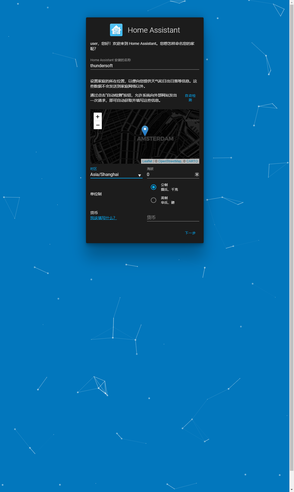
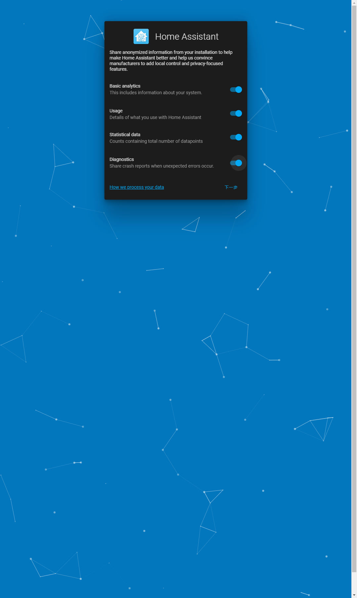
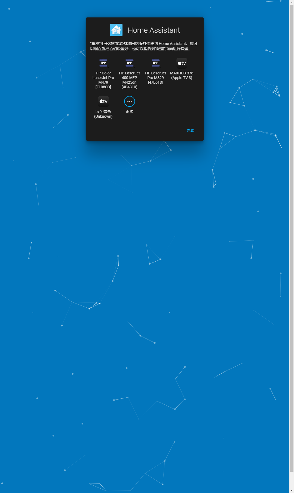
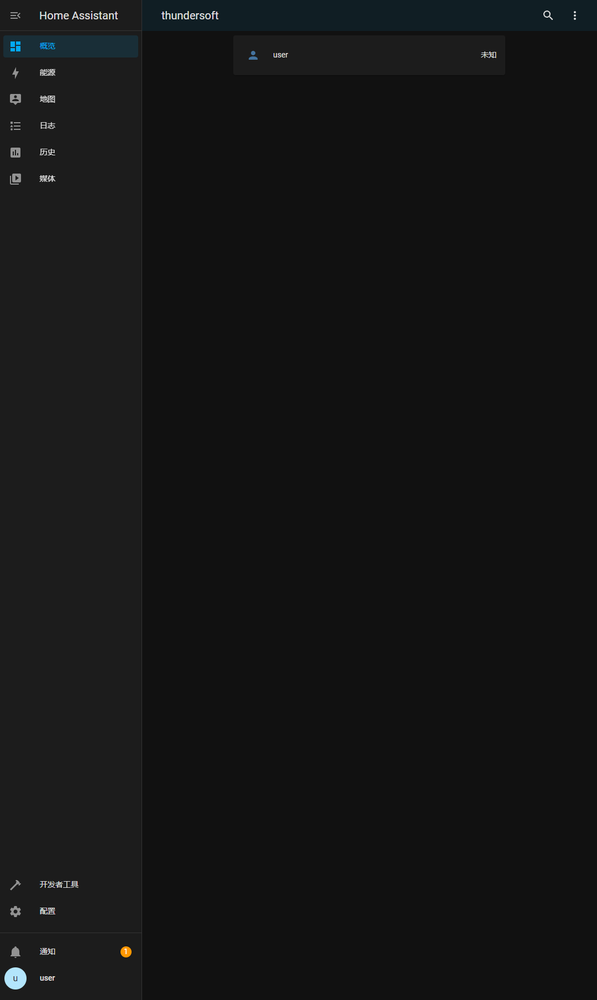
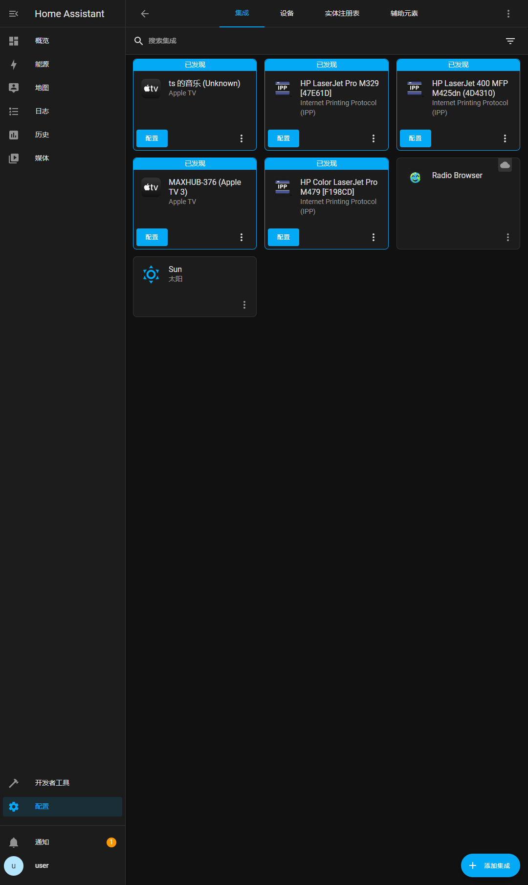
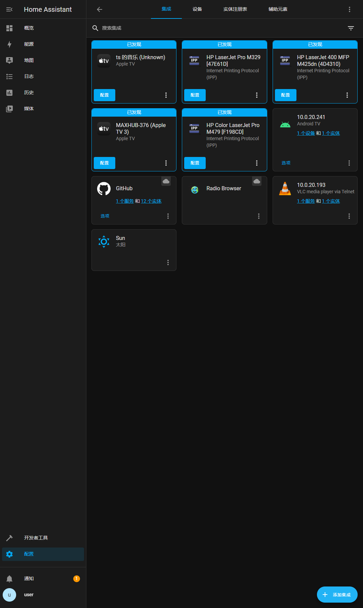
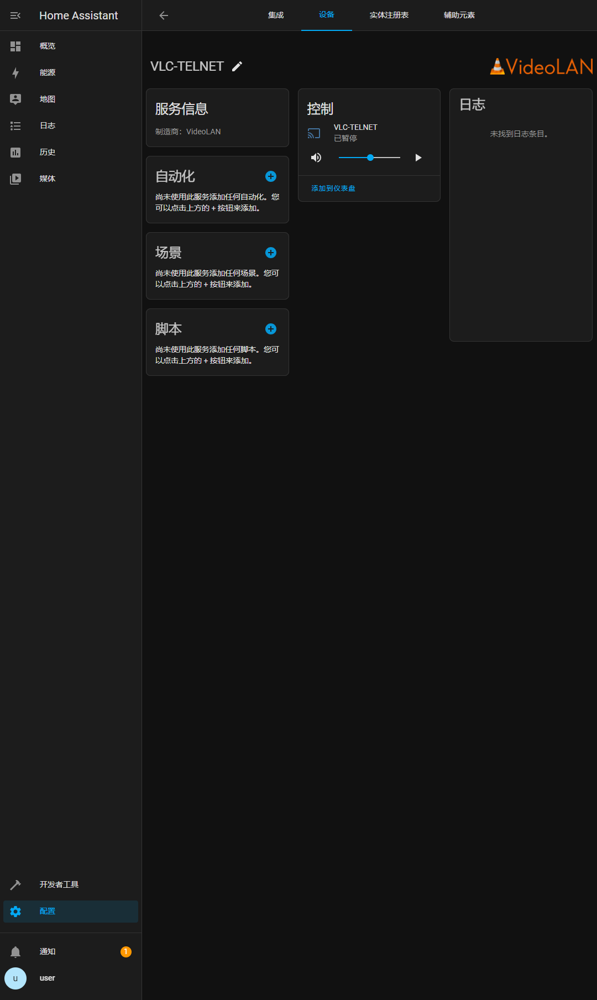
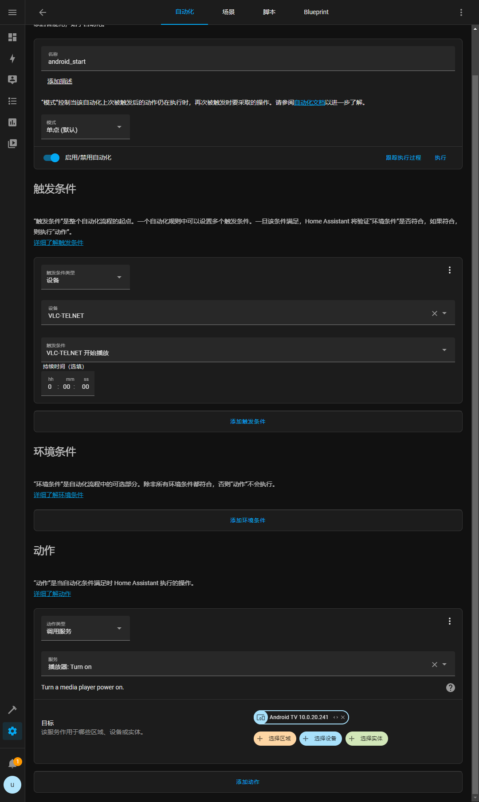

# Env
## Hardware
* (飞腾 FT-D2000)[https://item.jd.com/100014588907.html]
## Software
* (openEuler-22.03-LTS)[https://repo.openeuler.org/openEuler-22.03-LTS/edge_img/aarch64/openEuler-22.03-LTS-edge-aarch64-dvd.iso]
# Install


## install
* 采用docker的方案去部署整个home assistant的服务

### Docker Install
```
# 通过二进制包的方式安装docker
wget https://download.docker.com/linux/static/stable/aarch64/docker-20.10.17.tgz
dnf install tar -y
tar zxvf docker-20.10.17.tgz
cp -p docker/* /usr/local/bin

# 配置docker服务
sudo cat > /usr/lib/systemd/system/docker.service <<EOF
[Unit]
Description=Docker Application Container Engine
Documentation=http://docs.docker.com
After=network.target docker.socket
[Service]
Type=notify
EnvironmentFile=-/run/flannel/docker
WorkingDirectory=/usr/local/bin
ExecStart=/usr/local/bin/dockerd -H tcp://0.0.0.0:4243 -H unix:///var/run/docker.sock --selinux-enabled=false --log-opt max-size=1g
ExecReload=/bin/kill -s HUP $MAINPID
# Having non-zero Limit*s causes performance problems due to accounting overhead
# in the kernel. We recommend using cgroups to do container-local accounting.
LimitNOFILE=infinity
LimitNPROC=infinity
LimitCORE=infinity
# Uncomment TasksMax if your systemd version supports it.
# Only systemd 226 and above support this version.
#TasksMax=infinity
TimeoutStartSec=0
# set delegate yes so that systemd does not reset the cgroups of docker containers
Delegate=yes
# kill only the docker process, not all processes in the cgroup
KillMode=process
Restart=on-failure
[Install]
WantedBy=multi-user.target
EOF


groupadd docker
chgrp docker /var/run/docker.sock

systemctl enable docker
systemctl start docker

# 验证docker是否成功安装
docker run hello-world

```
* 运行`docker run hello-world`,无法启动，使用`dockerd`命令可获得下面的错误提示

```
#可以尝试关闭防火墙
systemctl stop firewalld
systemctl disable firewalld
```
## Home Assistant Install
* 通过docker 容器的方式去运行整个项目
```
docker run -d \
  --name homeassistant \
  --privileged \
  --restart=unless-stopped \
  -e TZ=China/Beijing \
  -v /root:/config \
  --network=host \
  ghcr.io/home-assistant/home-assistant:stable
```
* 配合演示，准备了一台装有vlc的ubuntu机器，以及Android机器。
  ```
  # 启动vlc
  vlc -I telnet --telnet-password test -vvv /home/yons/data/test.mp4 /home/yons/data/test2.mp4 --ttl 12 --loop
  ```
### 访问该设备的`8123`端口，进入该项目

  * 首先创建用户及密码
  
    
  * 配置位置及时区
  
    
    
  * 扫描局域网中的设备
  
    
  * 进入概览
  
    
  * 添加设备和服务,添加vlc， android tv 及 GitHub 服务或设备
  
    
    
    
  * 添加自动化，通过点击vlc播放，打开Android 设备
  
    
    
  * 演示效果，点击播放vlc,回看到打开Android设备
  
    
