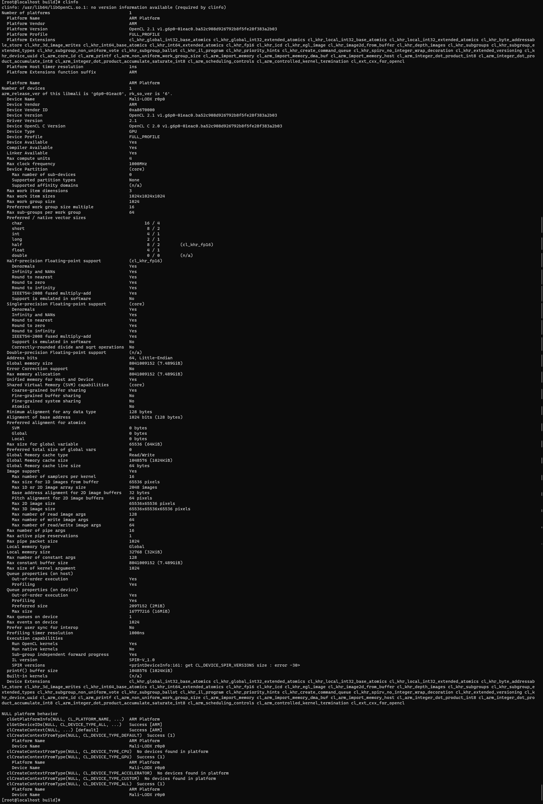
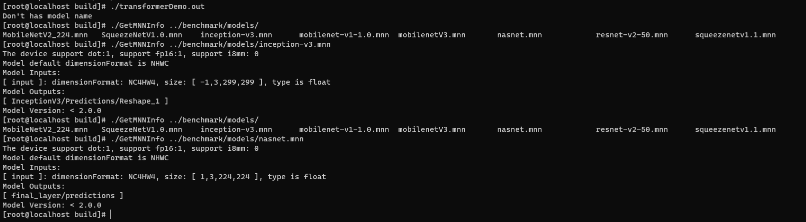
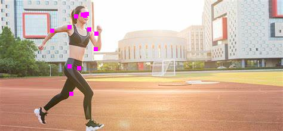

# Install related packages

## Install OpenCL dynamical libraries
```
ln -s libmali.so libOpenCL.so.1
ln -s libOpenCL.so.1 libOpenCL.so
```
## Install clinfo packages
[clinfo-2.2.18.04.06-6.aarch64.rpm](mnn/../packages/clinfo-2.2.18.04.06-6.aarch64.rpm)
```
dnf install clinfo-2.2.18.04.06-6.aarch64.rpm
```
* verified opencl info
```
clinfo
```

# Download
```
git clone https://github.com/alibaba/MNN
cd MNN
./schema/generate.sh
mkdir build
cd build
cmake -DMNN_OPENMP=ON -DMNN_BUILD_DEMO=ON -DMNN_OPENCL=ON -DMNN_ARM82=ON -DMNN_BUILD_CONVERTER=ON ..
cmake --build ./ -j$(nproc)

./tools/script/get_model.sh
```
* [reference](https://www.yuque.com/mnn/cn/build_linux)

# Verify
```
./GetMNNInfo ../benchmark/models/inception-v3.mnn
./GetMNNInfo ../benchmark/models/nasnet.mnn
```



## pose detection
```
wget https://raw.githubusercontent.com/czy2014hust/posenet-python/master/models/model-mobilenet_v1_075.pb
./MNNConvert -f TF --modelFile model-mobilenet_v1_075.pb --MNNModel pose.mnn --bizeCode MNN
./multiPose.out pose.mnn input.jpg pose.jpg
```
### input

### pose detection reslut
