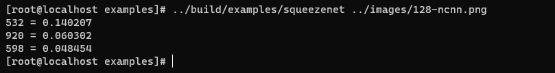

# Download
```
git clone https://github.com/Tencent/ncnn.git
cd ncnn
git submodule update --init
```

# Build
```
cd ncnn
mkdir -p build
cd build
cmake -DCMAKE_BUILD_TYPE=Release  -DNCNN_BUILD_EXAMPLES=ON -DNCNN_SIMPLEOCV=ON ..
make -j$(nproc)
``` 

# Verify
```
cd ../examples
../build/examples/squeezenet ../images/128-ncnn.png

```
* result
